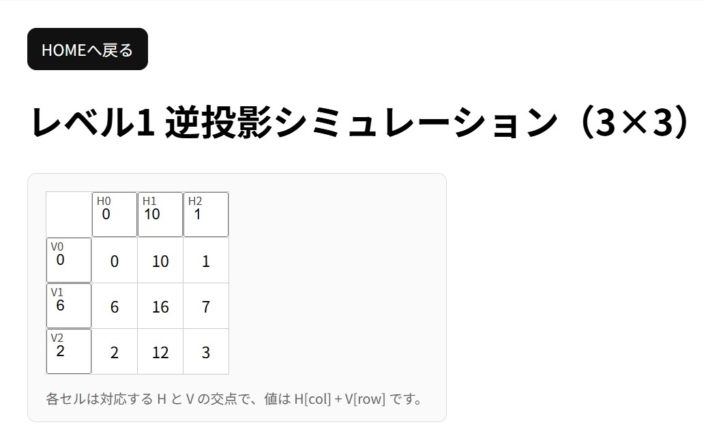
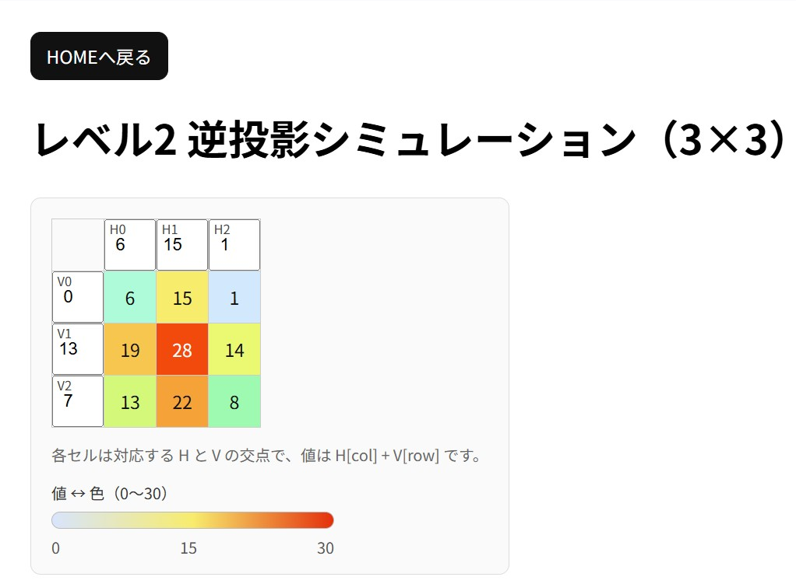
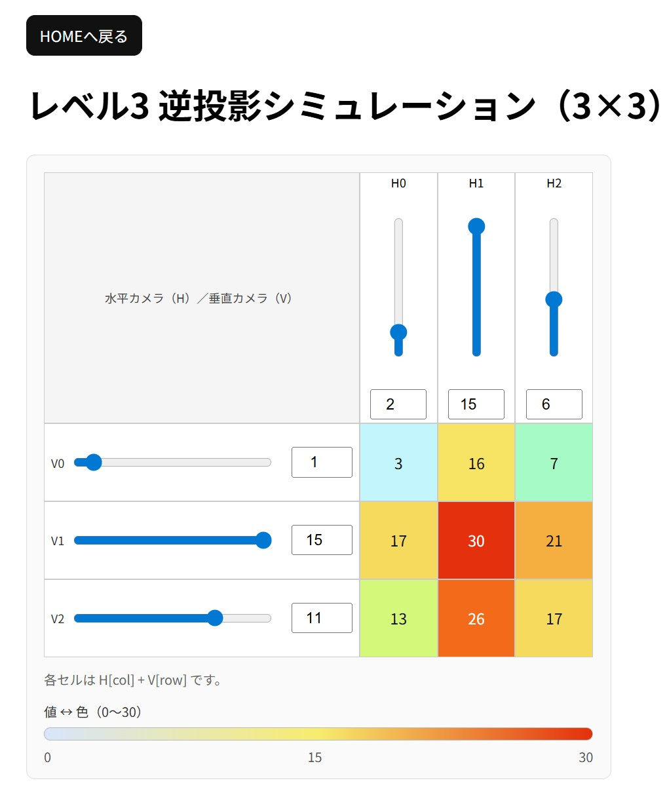

# 3D Reconstruction Simulator (Back-projection Method)
### 逆投影法を用いた3次元化シミュレーター

画像再構成理論の基礎である「逆投影法（Back-projection）」を直感的に理解するためのインタラクティブ・シミュレーターを構築しました。

---

## 🤖 AI駆動型開発（AI-Driven Development）の導入
本プロジェクトは、次世代の開発手法である「AI駆動型開発」の実践を目的としています。
AIエディタ **Cursor** をフル活用し、以下のプロセスで開発効率を極限まで高めました。

- **ペアプログラミング:** ロジックの複雑な「逆投影計算」や「リアルタイム連動」において、AIと対話しながらバグの早期発見と最適化を実施。
- **インフラトラブルシューティング:** Linux環境（VirtualBox/Ubuntu）特有の権限エラー（EACCES等）に対し、AIの知見を活用して迅速に解決。
- **高速なフィードバックループ:** Cursorの機能を活かし、仕様変更（レベル1からレベル3への進化）を10時間という短期間で完遂。

「AIを単なる補助ツールではなく、開発のパートナーとしていかに乗りこなすか」という、現代のエンジニアに求められるプロンプトエンジニアリング能力と、実行力を重視して開発に臨みました。

## 🚀 プロジェクト概要
本プロジェクトは、CTスキャンや3次元復元の基礎理論である「逆投影法」を、3×3の低解像度モデルで視覚化したものです。
2方向（水平・垂直）からの投影データ（積分値）を、計算によって元の3次元（2次元平面）構造へ再構成するプロセスを体験できます。

## 📸 デモ画面

### Level 1: 白黒表示
デモのベースとなるシンプルな表示。


### Level 2: ヒートマップ表示
数値の大きさを色（青〜赤）のグラデーションで表現しました。


### Level 3: インタラクティブ・シミュレーション（完成形）
水平・垂直のスライダーを操作することで、リアルタイムに中央の輝度分布が更新されます。
 

---

## 🛠 実装のこだわり（10時間の実績）

### 1. 段階的な開発アプローチ
- **Level 1:** アルゴリズムの数学的妥当性の検証（数値計算のみ）。
- **Level 2:** 計算結果の視覚化。カラーパレットによる定量的評価の導入。
- **Level 3:** スライダーUIによる動的フィードバックの実装。

### 2. インタラクティブな操作性
- 水平（H）スライダーを垂直に、垂直（V）スライダーを水平に配置。物理的なカメラの視線方向と操作を一致させるUI/UXを設計しました。
- 入力値と出力値の双方向リアルタイム連動（JavaScript/Vite環境）により、試行錯誤のループを高速化しました。

### 3. 技術スタック
- **Backend:** PHP 8.4 / Laravel 12
- **Frontend:** TypeScript
- **Build Tool:** Vite (npm run dev によるホットリロード環境)
- **Environment:** Ubuntu (VirtualBox) 内のDocker上でのインフラ構築から実施

---

## 📖 原理の説明
各セル $(col, row)$ の値は、対応する水平投影 $H_{col}$ と垂直投影 $V_{row}$ の和として算出されます。

$$Value(col, row) = H_{col} + V_{row}$$

これは、投影データを逆方向に引き延ばして重ね合わせる「単純逆投影法」を最もシンプルにモデル化したものです。

---

## ⚡ セットアップ
```bash
# リポジトリのクローン後
composer install
npm install
cp .env.example .env
php artisan key:generate

# 実行
php artisan serve
npm run dev